# 🏛️ ARCHITECTURE DIAGRAMS

VISUAL REPRESENTATIONS OF THE COBOL RESURRECTION BRIDGE SYSTEM ARCHITECTURE

---

## 📊 SYSTEM OVERVIEW

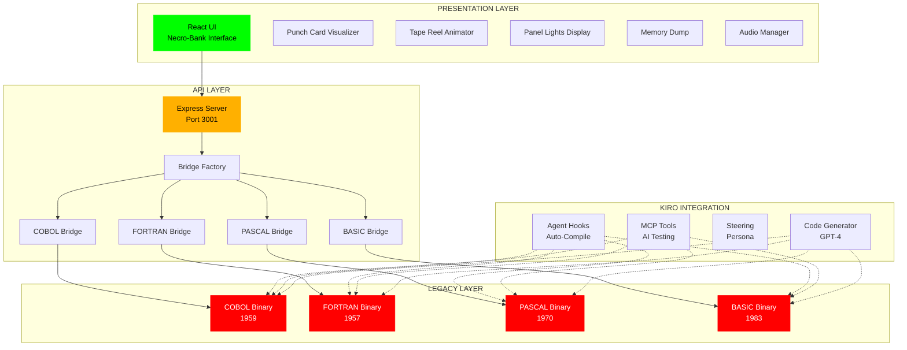

---

## 🔄 DATA FLOW - CALCULATION REQUEST

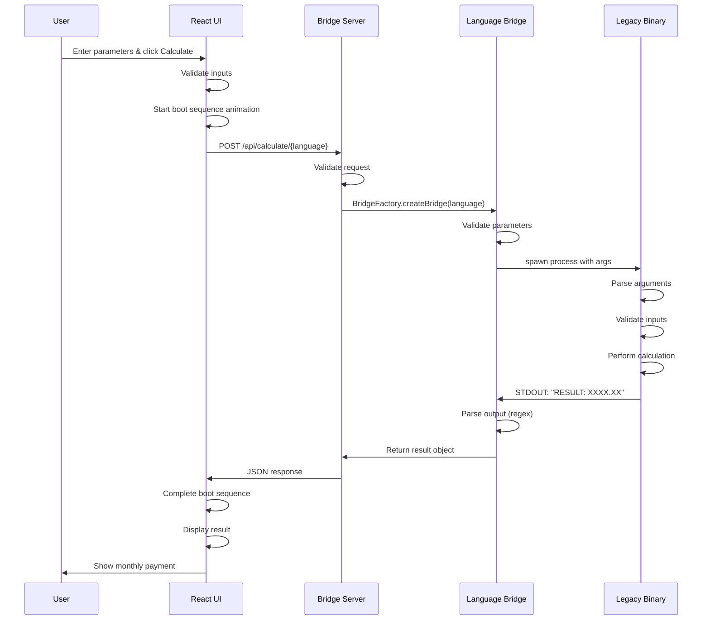

---

## 🤖 AI CODE GENERATION FLOW

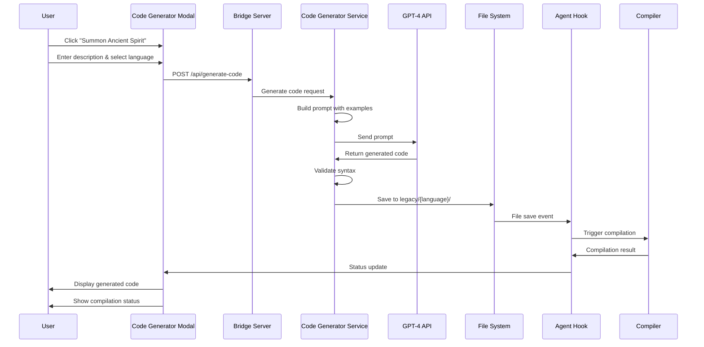

---

## 🏗️ BRIDGE PATTERN ARCHITECTURE

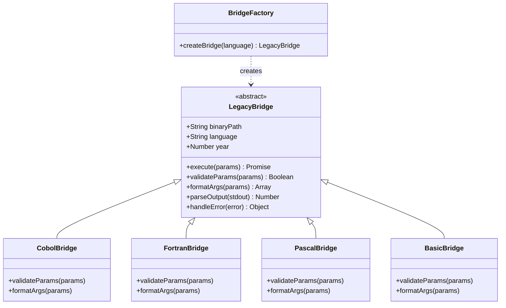

---

## 📦 COMPONENT HIERARCHY

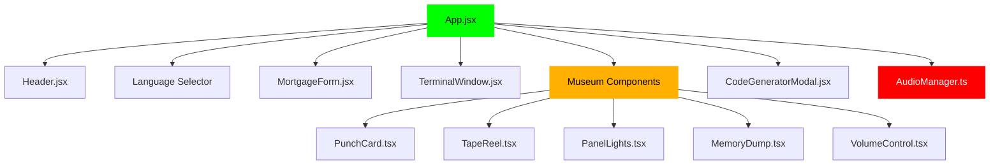

---

## 🗂️ DIRECTORY STRUCTURE

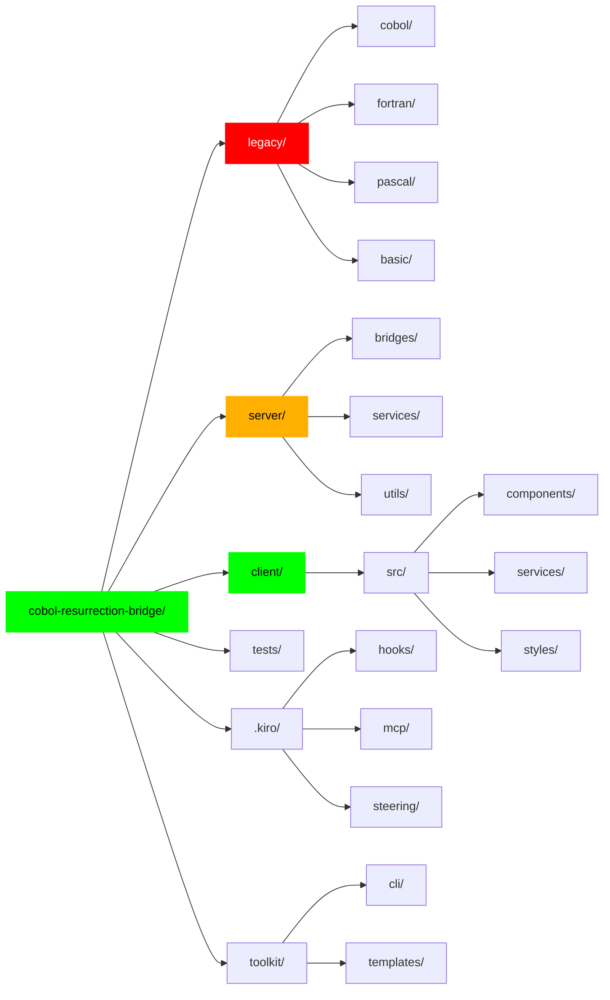

---

## 🔌 API ENDPOINT ROUTING

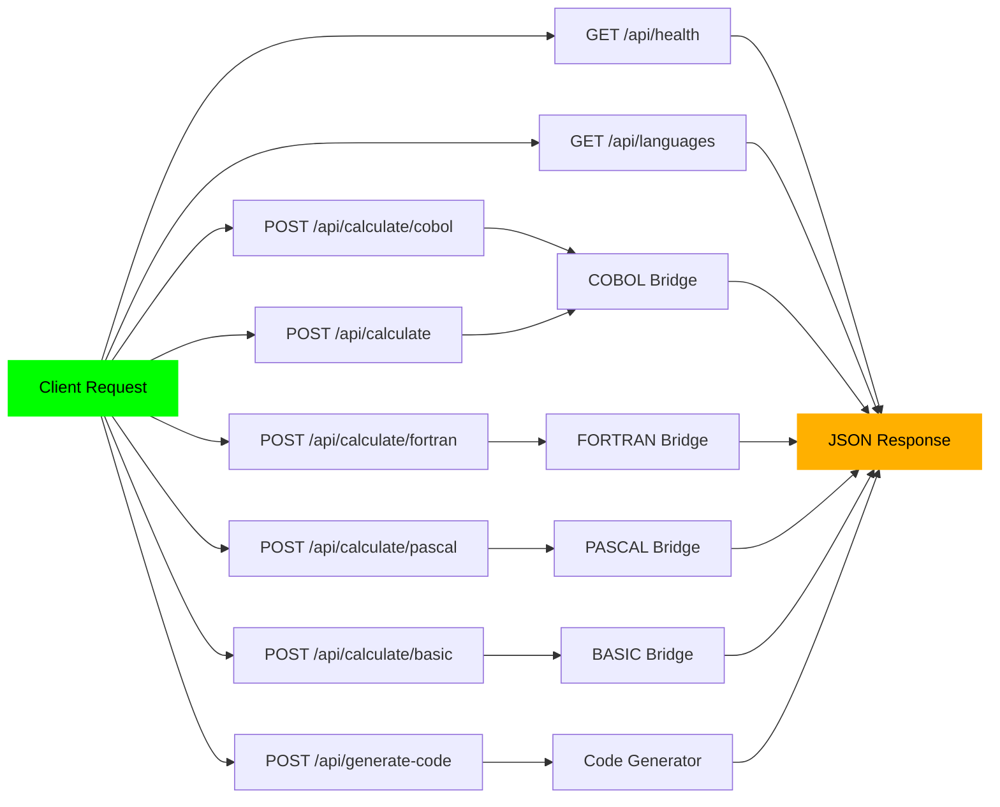

---

## 🧪 TESTING ARCHITECTURE

```mermaid
graph TB
    subgraph "PROPERTY-BASED TESTS"
        PBT1[Calculation Accuracy]
        PBT2[Output Format]
        PBT3[Error Handling]
        PBT4[Bridge Behavior]
        PBT5[UI Properties]
    end
    
    subgraph "UNIT TESTS"
        UT1[Component Tests]
        UT2[Bridge Tests]
        UT3[API Tests]
        UT4[Utility Tests]
    end
    
    subgraph "INTEGRATION TESTS"
        IT1[End-to-End Flow]
        IT2[Multi-Language]
        IT3[Error Scenarios]
        IT4[Code Generation]
    end
    
    subgraph "TEST FRAMEWORK"
        Vitest[Vitest]
        FastCheck[fast-check]
        TestingLib[Testing Library]
    end
    
    PBT1 --> FastCheck
    PBT2 --> FastCheck
    PBT3 --> FastCheck
    PBT4 --> FastCheck
    PBT5 --> FastCheck
    
    UT1 --> TestingLib
    UT2 --> Vitest
    UT3 --> Vitest
    UT4 --> Vitest
    
    IT1 --> Vitest
    IT2 --> Vitest
    IT3 --> Vitest
    IT4 --> Vitest
    
    style FastCheck fill:#00ff00,stroke:#00ff00,color:#000
    style Vitest fill:#ffb000,stroke:#ffb000,color:#000
```

---

## 🚀 DEPLOYMENT ARCHITECTURE

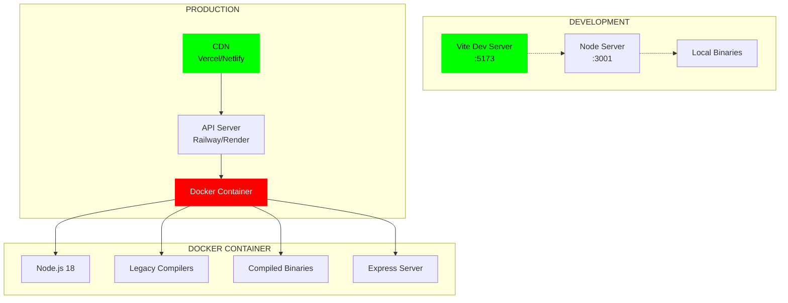

---

## 🔐 SECURITY LAYERS

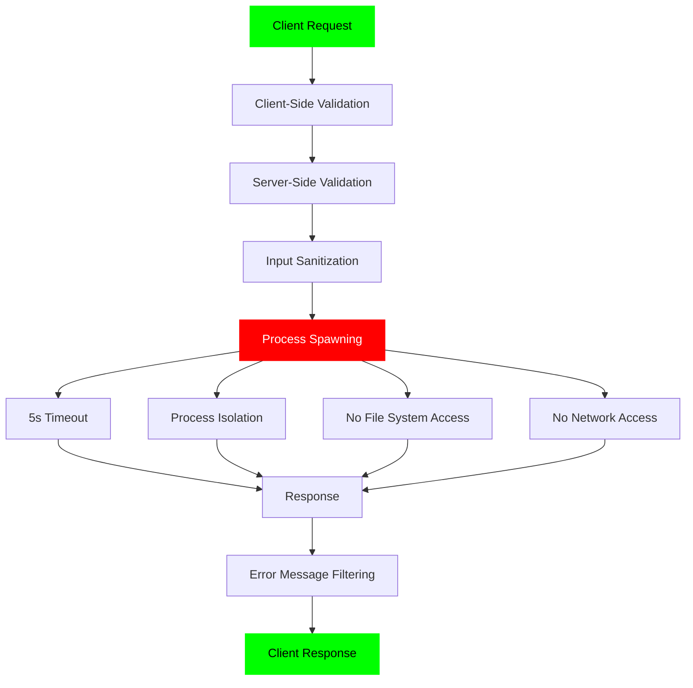

---

## 📊 PERFORMANCE CHARACTERISTICS

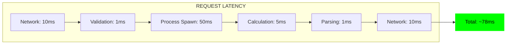

---

## 🎯 KIRO INTEGRATION POINTS

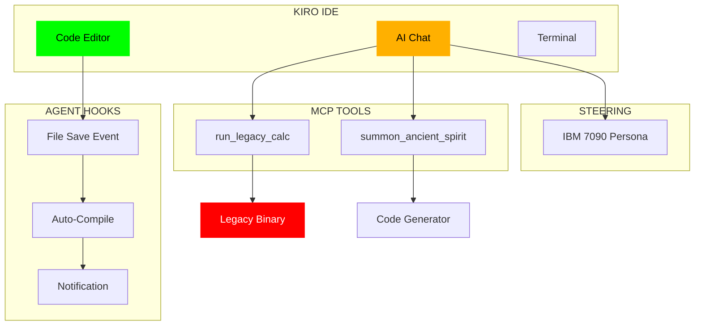

---

## 🔄 TOOLKIT CLI WORKFLOW

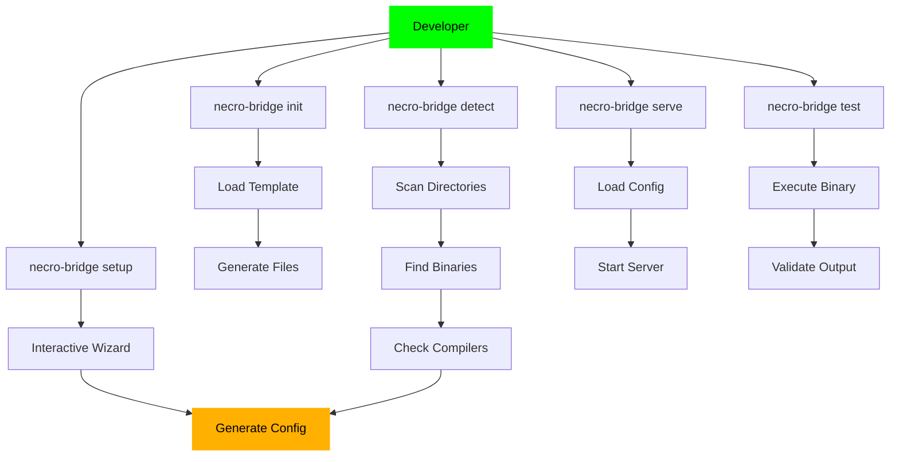

---

## 📈 SCALABILITY MODEL

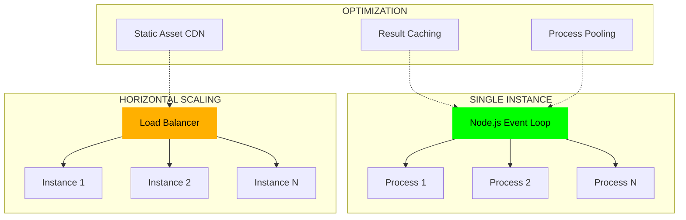

---

**DIAGRAMS STATUS**: COMPREHENSIVE  
**VISUAL DOCUMENTATION**: COMPLETE  
**ARCHITECTURE**: ILLUSTRATED  

`[END OF TAPE]`
